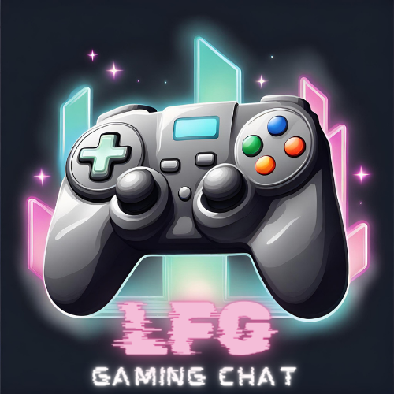

<div align="center"> </img> </div>

# LFG Backend

<details>
  <summary>Contenido 📝</summary>
  <ol>
    <li><a href="#Objetivo🎯">Objetivo🎯</a></li>
    <li><a href="#Sobre-el-proyecto📰">Sobre el proyecto 📰</a></li>
    <li><a href="##Stack ✨">Stack ✨</a></li>
    <li><a href="##Diagrama BD 🌐">Diagrama BD 🌐</a></li>
    <li><a href="##Instalaciónenlocal 💻"> Instalación en local 💻</a></li>
    <li><a href="##Endpoints 🎢">Endpoints 🎢</a></li>
    <li><a href="##Futurasfuncionalidades ✅">Futuras funcionalidades ✅</a></li>
    <li><a href="##Webgrafia 👓">Webgrafia 👓</a></li>
    <li><a href="##Compañerosdeequipo 🐱‍👤:"> Compañeros de equipo 🐱‍👤:</a></li>    
  </ol>
</details>

## Objetivo🎯

Este proyecto requería una API funcional conectada a una base de datos en la que simula una aplicación web que permite a los usuarios contactar con otros usuarios a través de salas de videojuegos con la tecnología PHP Laravel. Además, este proyecto se ha realizado en grupo para así poder trabajar herramientas de gestión de tickets (organización de tareas a través de una plataforma como trello), trabajo en equipo y gestión del tiempo de forma eficiente.

## Sobre el proyecto 📰

LFG Backend es una aplicación web dónde los usuarios podrán registrarse e iniciar sesión para así poder crear salas en función a una lista de videojuegos para que otros usuarios puedan unirse para conversar en dichas salas.

## Stack ✨

Tecnologías utilizadas:

<div align="center">
<a href="">
    
</a>
<a href="https:">
    
</a>
<a href="https://">
    
</a>
<a href="https://">
    
</a>
<a href="https://">
    
</a>
<a href="https://">
    
</a>
<a href="https://">
    
</a>
 </div>

## Diagrama BD 🌐

</img>

## Instalación en local 💻

Nota: para este proyecto será necesario tener instalado en local PHP y Composer

<a href="https://www.php.net/manual/en/install.php"> Descarga PHP </a>

<a href="https://getcomposer.org/download/"> Descarga Composer </a>

1. Clonar el repositorio
2. Instalamos dependencias
   `$ composer install`
3. Conectamos nuestro repositorio con la base de datos, para ello creamos el archivo .env copiando los datos de .env.example y rellenamos los campos con la conexión a nuestra base de datos en local.
4. Ejecutamos las migraciones
   `$ php artisan migrate`
5. Ejecutamos los seeders
   ` $ php artisan db:seed`
6. Iniciamos el servidor
   `$ php artisan serve`
7. ...

## Endpoints

<details>
<summary>Endpoints</summary>
Credenciales SuperAdmin:

        ``` js
            {
                "email": "super_admin@super_admin.com",
                "password": "123456"
            }
        ```

-   AUTH

        -   REGISTER

                  POST http://localhost:3000/api/register

                POST localhost:8000/api/auth/register
            body:

            ```js
                {
                    "nickName": "Datata",
                    "fullName": "Dani Apellido",
                    "email": "dani@dani.com",
                    "password": "princess",
                }
            ```

        -   LOGIN

                  POST http://localhost:3000/api/login

                POST localhost:8000/api/auth/login

    body:

            ```js
                {
                    "email": "super_admin@super_admin.com",
                    "password": "123456"
                }
            ```

-   USERS

    -   UPDATE PROFILE

              PUT localhost:8000/api/users/profile

        Auth: token usuario logeado
        body:

        ```js
            {
                "fullname": "Fnatic",
            }
        ```

    -   DELETE PROFILE

              DELETE localhost:8000/api/users/profile

        Auth: token usuario logeado

    -   GET PROFILE

        GET localhost:8000/api/users/profile
        Auth: token usuario logeado

    -   GET ALL USERS

        GET localhost:8000/api/users
        Auth: token super_admin

-   GAMES

    -   CREATE GAME

              POST localhost:8000/api/games

        Auth: token SuperAdmin
        body:

        ```js
            {
                "game_name": "Genshin Impact",
                "description": "Gachapon mundo abierto"
                "game_image": "https://preview.redd.it/ntccsv49x1a51.png?auto=webp&s=defee6ae55163ba253a3a7fa9007e584d5087bac"
            }
        ```

    -   GET GAMES

              GET localhost:8000/api/games

    -   UPDATE GAME

              PUT localhost:8000/api/games/{id}

        Auth: token SuperAdmin
        body:

        ```js
            {
                "description": "Descripción editada"
            }
        ```

    -   DELETE GAME

              DELETE localhost:8000/api/games/{id}

        Auth: token SuperAdmin

-   MESSAGES

    -   CREATE MESSAGE

              POST localhost:8000/api/messages/{id}

        Auth: token usuario logeado
        body:

        ```js
            {
                "message": "Hola a todos",
            }
        ```

    -   GET ROOM MESSAGES

            GET localhost:8000/api/messages

    -   UPDATE MESSAGE

              PUT localhost:8000/api/messages/{id}

        Auth: token usuario logeado
        body:

        ```js
            {
                "message": "Adiós a todos",
            }
        ```

-   DELETE MESSAGE

           DELETE localhost:8000/api/messages/{id}

    Auth: token super_admin

-   ROOMS

    -   CREATE ROOM

              POST localhost:8000/api/rooms

        Auth: token usuario logeado
        body:

        ```js
            {
                "room_name": "TOP Tier",
                "room_description" : "equipo competitivo",
                "game_id":"1"
            }
        ```

    -   UPDATE ROOM

              PUT localhost:8000/api/rooms/{id}

        Auth: token usuario logeado
        body:

        ```js
            {
                "room_name": "Fnatic",
            }
        ```

    -   DELETE ROOM

              DELETE localhost:8000/api/rooms/{id}

        Auth: token usuario logeado

    -   GET GAMEROOM

        GET localhost:8000/api/rooms/{game_id}
        Auth: token usuario logeado

    -   JOIN ROOM

        POST localhost:8000/api/rooms/{room_id}/join
        Auth: token usuario logeado

    -   LEAVE ROOM

        DELETE localhost:8000/api/rooms/{room_id}/leave
        Auth: token usuario logeado

</details>

## Futuras funcionalidades ✅

[✔] Aplicación de validaciones
[ ] Endpoint traer usuarios de una sala

## Webgrafia 👓

Para conseguir mi objetivo he recopilado información de:

-   <a href="https://laravel.com/docs/9.x/"> Laravel 9.x </a>

## Compañeros de equipo 🐱‍👤:

-   **Fernando**
    <a href="https://github.com/FernandoCatalaMunyoz" target="_blank"></a>

-   **Miguel**  
    <a href="https://github.com/Miguel21S" target="_blank"></a>

-   **_Antonio_**  
    <a href="https://github.com/MR-ant1" target="_blank"></a>

-   **Ana**
    <a href="https://github.com/ariusvi" target="_blank"></a>
